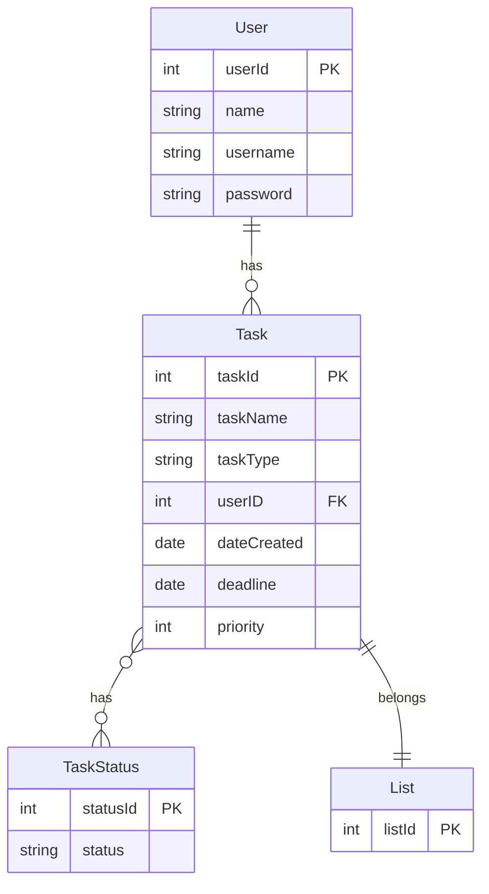

```mermaid
erDiagram
    User {
        int userId PK
        string name
        string username
        string password
    }

    Task {
        int taskId PK
        string taskName
        string taskType
        int userID FK
        date dateCreated
        date deadline
        int priority
    }

    TaskStatus {
        int statusId PK
        string status
    }

    List {
        int listId PK
    }

    User ||--o{ Task : has
    Task }o--o{ TaskStatus : has
    Task ||--|| List : belongs


```
